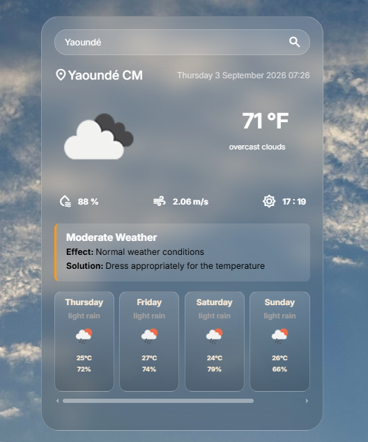

# 🌤️ Weather App

> An interactive weather application that allows users to search, explore, and analyze real-time weather details and forecasts for any city worldwide.


---

## 📌 Problem Statement

Many online weather platforms are slow to load and visually overwhelmed with complex meteorological data that the average user does not need. This Weather App addresses this issue by centralizing key live data—such as temperature, humidity, and general conditions—into a minimalist and fast-loading interface tailored for daily use.


---


## 🎯 Project Goals

- Enable users to **dynamically search for any city's weather conditions** using its name.
- Extract and visually structure essential real-time data such as current temperature, humidity levels, and weather descriptions.
- Provide a smooth, ultra-fast browsing experience without the overhead of heavy frontend frameworks.


---

## 🛠️ Tech Stack

**Technologies Used:**   
- **HTML5:** For semantic page structuring and building the interactive search interface. 
- **CSS3:** For a modern, responsive, and clean user interface design.
- **JavaScript:** For capturing search events, executing DOM manipulation, and handling asynchronous API requests. 

**Third-party Tools & APIs:** 
- **Weather REST API (OpenWeatherMap):** Endpoint used to fetch and stream live, real-time meteorological data based on user input.


## 🖥 Features

- **Dynamic City Search:** Instantly look up weather conditions for any city worldwide.
- **Search History:** Saves your recent searches using `localStorage` for quick access later.
- **Error Handling:** Displays a clear message if a city is not found or if the network fails.
- **No Page Reloads:** Updates the screen instantly using asynchronous JavaScript.


---

## 📷 Screenshots



---

## ⚙️ Installation & Setup

To clone and run this project locally, execute the following commands in your terminal:

```bash
# Clone the repository
git clone https://github.com/RusselFonta/Weather-App.git

# Navigate into the project directory
cd Weather-App

# Switch Branch to feature/Weather_App if your are on the main branch
 git checkout feature/Weather_App
```

---

## 🧠 Challenges Faced

- **Fixing Click Bugs:** Moving the Celsius/Fahrenheit toggle outside the fetch function to stop duplicate event listeners.
- **Syncing Multi-Fetch Requests:** Using `Promise.all()` to make sure current weather and 5-day forecasts load together perfectly.
- **Handling UI Timing:** Ensuring all complex data arrays parse successfully before updating the screen layout.

---

## 📚 What I Learned

- **Parallel Fetching:** Using `Promise.all()` to load multiple API requests at the same time to speed up performance.
- **State Management:** Managing a global variable to toggle temperature conversion seamlessly between Celsius and Fahrenheit.
- **Data Safety:** Using clean object syntax to display dynamic text safely based on varying conditions.

---

 ## 🚀 Future Improvements

- **Satellite Data Integration:** Fetching real-time weather and cloud coverage parameters sourced directly from OpenWeather's satellite feeds.
**Auto-Location:** Use the browser's Geolocation API to automatically load the user's local weather on startup.
- **Search History UI:** Add clickable buttons for recently searched cities saved in `localStorage`.
- **Weather Charts:** Integrate a simple library like Chart.js to display 5-day temperature trends visually.

---
## 👨🏽‍💻 Author

**Russel Fonta Fadil**  
*Junior Fullstack Developer*  

- 📩 **Email:** fontawestbrook99@gmail.com  
- 🌍 **Location:** Cameroon (Open to remote opportunities)  
- 💼 **GitHub:** [RusselFonta](https://github.com/RusselFonta)

